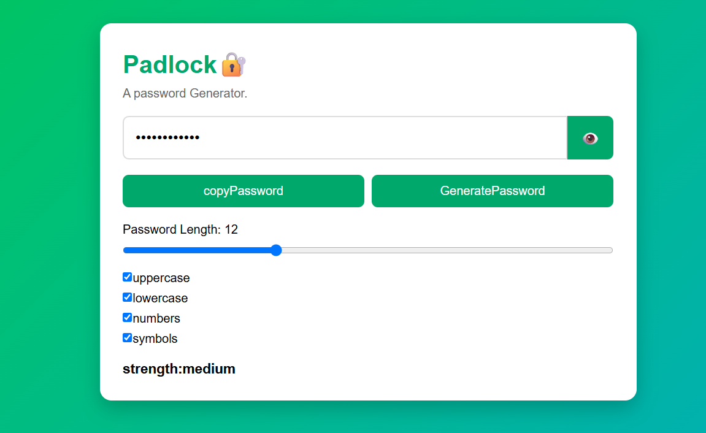

# 🔐 Padlock - Password Generator

Padlock is a simple and user-friendly **Password Generator** built using HTML, CSS, and JavaScript. It allows users to generate secure passwords based on their preferred length and character types.

## ✨ Features

- Generate random passwords
- Choose password length (4–30 characters)
- Include uppercase letters
- Include lowercase letters
- Include numbers
- Include symbols
- Show/Hide password
- Copy password to clipboard
- Displays password strength

## 🛠️ Technologies Used

- HTML
- CSS
- JavaScript

## 📸 Screenshot



## 🚀 How to Run

1. Clone or download this repository.
2. Open the project folder.
3. Open `index.html` in your browser.
4. Select your preferred password options.
5. Click **Generate Password**.

## 📂 Project Structure

```text
Padlock/
│
├── index.html
├── style.css
├── script.js
└── screenshot.png
